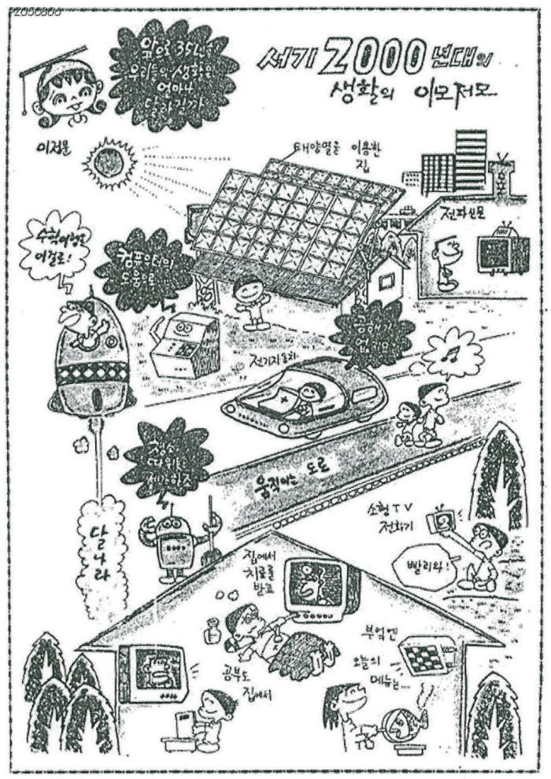

# Welcome to E26-SW01-06

## 🎯 팀 슬로건

> 팀 슬로건을 작성합니다.

## 🖼️ 팀 포스터

<div class="poster"></div>

<p align="center" class="poster-caption"><sub>이정문 화백, 「서기 2000년대 생활의 이모저모」(1965). 출처: <a href="https://v.daum.net/v/d4FeeJV0EN">전자신문 [과학 핫이슈] 1965년에 상상한 2000년대, 지금 그려보는 20년 후</a></sub></p>

1965년에 35년 뒤의 생활을 상상해 그린 이 그림처럼, 우리 팀이 그리는 미래를 포스터로 만들어 봅시다.
팀 활동으로 만든 포스터를 `poster.jpg` 파일 이름으로 이 repository에 업로드하면 위 그림이 팀 포스터로 바뀝니다.
파일 이름이 다르거나 png 파일이면 위 ``의 파일 이름을 맞추고, 출처 문구도 팀에 맞게 고쳐 주세요.

> **포스터 파일 권장 규격**: A4 세로 비율(1 : 1.414), 1240×1754px 이상, JPG, 2MB 이하.
> 홈페이지에서는 어떤 크기·비율의 파일을 올려도 같은 크기의 세로 틀 안에 맞춰 표시되지만, 권장 규격을 지키면 여백 없이 가장 선명하게 보입니다.

***

## 1️⃣ 팀원 소개

| **이름** | **전공** | **관심사** |
| --- | --- | --- |
| **김태희** | 소프트웨어전공 | 컴퓨터구조, 전자회로, 인공지능, 게임 |
| **방현지** | 소프트웨어전공 | 임베디드, 로봇, 게임 |
| **신지은** | 소프트웨어전공 | 프론트엔드, 자율주행, 게임 |

유레카프로젝트 팀 생성을 축하합니다.
팀의 제목과 슬로건, 팀원의 이름 및 관심사를 변경하세요.

### 팀 소개

안녕하세요 유레카 6조 팀 김태희, 방현지, 신지은입니다. 저희 팀은 각자 관심 있는 분야와 진로는 조금씩 다르지만, 공통적으로 소프트웨어 분야에 관심이 있고 게임을 좋아한다는 공통점이 있습니다. 이번 유레카 프로젝트를 통해 앞으로 활동하면서 각자의 생각과 경험을 공유하고 서로에게 도움이 될 수 있는 팀이 되고자 합니다.
***

## 2️⃣ 공통된 관심사 : 게임

***

## 3️⃣ 한학기 동안의 활동 내역 

-2026.09.18
과거의 내가 현재에 어떤 것을 바랐을 지 생각해보고, 그것이 이루어졌는지 실현, 일부 실현, 미실현 3가지로 구분하여 조사해보자.
질문1. 2000년대가 오기 전, 사람들은 어떤 미래를 기대했을까?
1. 집안일 해주는 로봇
분류: 실현
근거: 사람이 직접 수행하던 집안일의 일부를 로봇이 대신한다는 핵심 기능이 구현됨.
2. 공중 자동차
분류: 일부 실현
근거: 실제 비행이 가능한 기술은 개발되었지만 일반인이 일상적인 이동수단으로 사용할 정도로 상용화되지는 않음.
3. 전쟁 로봇
분류: 일부 실현
근거: 인간형 전투 로봇은 아니지만 드론과 무인기 등이 실제 전쟁에서 전투 임무에 활용되고 있음.
4. 뇌 전파 공유(텔레파시)
분류: 일부 실현
근거: 뇌 신호를 이용해 기기를 제어하거나 의사소통을 돕는 BCI 기술이 개발되고 있지만 생각을 사람에게 직접 전달하는 수준은 아님.
5. 우주 택배
분류: 일부 실현
근거: 우주선과 로켓을 이용해 우주로 물자를 운송하는 기술은 구현되었지만 일반인이 택배처럼 이용할 정도로 상용화되지는 않음.
6. 텔레포트
분류: 미실현
근거: 사람이나 물체 자체를 다른 장소로 순간 이동시키는 기술은 현재 구현되지 않음.
7. 타임머신
분류: 미실현
근거: 사람이 과거나 미래의 특정 시간대로 자유롭게 이동할 수 있는 기술은 현재 구현되지 않음
8. 하나만 먹어도 배부른 알약
분류: 방향 전환
근거: 알약 하나로 식사를 완전히 대신하는 형태는 아니지만 위고비, 마운자로와 같은 식욕을 줄이고 포만감을 높이는 기술로 발전함.
9. 인공 장기
분류: 일부 실현
근거: 인공심장이나 장기 기능을 보조하는 의료기기는 실제로 사용되고 있지만 모든 장기를 자유롭게 인공적으로 제작학ㅎ 이식할 수 있는 수준은 아님.
10. 자율주행 자동차
분류: 일부 실현
근거: 차량이 주변 환경을 인식하고 스스로 주행하는 기술은 실제 차량에 적용되고 있지만 모든 도로와 상황에서 운전자 없이 완전히 주행할 수 있는 수준으로 보편화 되지는 않음.

- 기관/부서 인터뷰 ✔️  

- 현장 탐방 ✔️  

- 멘토링 ✔️  
  - 내 지도 교수 함게 만나기
  - 대학원 방문 및 선배 만나기

- 프로젝트 진행 ✔️  
  - 과거에 사람들이 상상한 미래
  - 그들이 만들어가는 세상
  - 우리가 상상한 미래
  - 우리가 그리는 미래 그리고 나

- 각오와 소감 나누기 ✔️  


<!-- 활동 사진 추가 예시 -->


***

## 4️⃣ 인상 깊은 활동

- 활동명 – 활동에 대한 간단한 설명과 배운 점을 작성  
- 예: 멘토링에서 실리콘밸리 현업 경험을 들을 수 있어 진로 방향 설정에 큰 도움이 되었다.  

***

## 5️⃣ 특별히 알아보고 싶은 것
- 예: 현장실습 제도
- 예: 학부 졸업 인증 조건
- 예: 성취기반평가
- 예: 졸업 후 진로(대학원/취업)

***

## 6️⃣ 활동을 마친 소감

🔗20262294 김태희
> "소감 내용을 여기에 작성합니다."

🔗20262307 방현지  
> "소감 내용을 여기에 작성합니다."

🔗학번 이름  
> "소감 내용을 여기에 작성합니다."

🔗학번 이름  
> "소감 내용을 여기에 작성합니다."

🔗학번 이름  
> "소감 내용을 여기에 작성합니다."


## Markdown을 사용하여 내용꾸미기를 익히세요.

Markdown은 작문을 스타일링하기위한 가볍고 사용하기 쉬운 구문입니다. 여기에는 다음을위한 규칙이 포함됩니다.

```markdown
Syntax highlighted code block

# Header 1
## Header 2
### Header 3

- Bulleted
- List

1. Numbered
2. List

**Bold** and _Italic_ and `Code` text

[Link](url) and 
```

자세한 내용은 [GitHub Flavored Markdown](https://guides.github.com/features/mastering-markdown/).

### Support or Contact

readme 파일 생성에 추가적인 도움이 필요하면 [도움말](https://help.github.com/articles/about-readmes/) 이나 [contact support](https://github.com/contact) 을 이용하세요.

